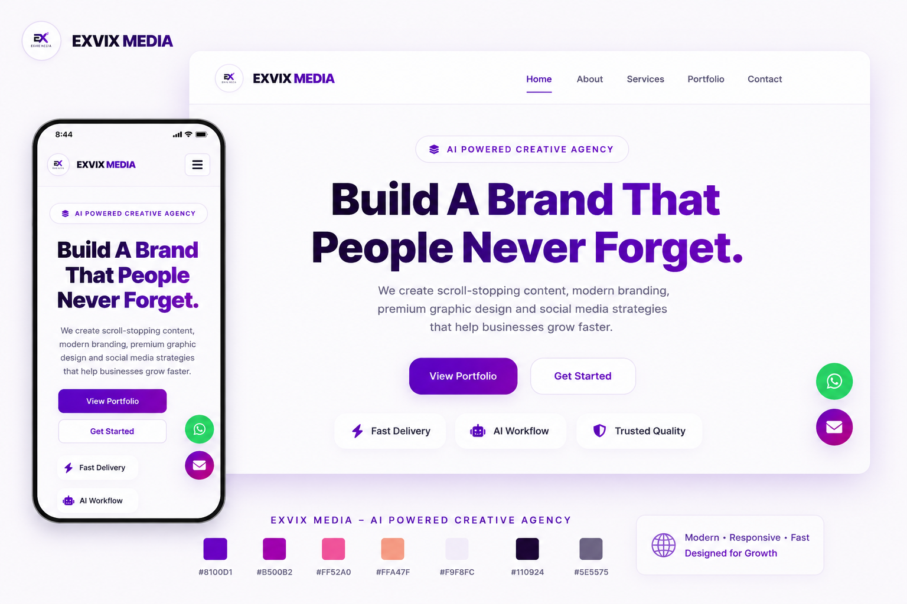

<div align="center">

# 🚀 Exvix Media Portfolio

### AI Powered Creative Agency

Modern • Responsive • Fast • SEO Optimized


<br>


</div>

---

# 📖 About

Exvix Media Portfolio is a modern, responsive landing page developed for **Exvix Media**, an AI-powered creative agency.

This project showcases the agency's services, portfolio, case studies and brand identity through a clean, minimal and conversion-focused interface.

The project is built entirely using **HTML, CSS and JavaScript**.

---

# ✨ Features

- 🎨 Premium UI Design
- 📱 Fully Responsive
- ⚡ Fast Loading
- 💼 Portfolio Showcase
- 📈 Case Study Section
- 💬 WhatsApp CTA
- 📧 Contact Form Interface
- 📑 About, Services & Contact Pages
- 🔍 SEO Optimized
- 🗺 Sitemap
- 🤖 robots.txt
- 📲 Progressive Web App Manifest
- 🚫 Custom 404 Page
- ✨ Smooth Animations
- 🧩 Clean Code Structure

---

# 🛠 Tech Stack

- HTML5
- CSS3
- JavaScript (ES6)

**No Frameworks**

**No Libraries**

Pure Frontend Development

---

# 📂 Folder Structure

```text
exvixmedia-portfolio/
│
├── assets/
│   ├── portfolio/
│   │   ├── project-1.png
│   │   ├── project-2.png
│   │   └── ...
│   │
│   ├── logo.png
│   ├── about.png
│   ├── case-study.png
│   ├── privacy.png
│   ├── terms.png
│   ├── client1.jpg
│   ├── client2.jpg
│   ├── client3.jpg
│   ├── portfolio-cover.jpg
│   └── favicon files
│
├── index.html
├── about.html
├── services.html
├── portfolio.html
├── contact.html
├── privacy-policy.html
├── terms-and-conditions.html
├── sitemap.html
├── 404.html
│
├── style.css
├── script.js
│
├── robots.txt
├── sitemap.xml
├── site.webmanifest
│
├── LICENSE
└── README.md
```

---

# 🎨 Brand Color Palette

| Color | Hex |
|--------|------|
| Primary Purple | `#8100D1` |
| Secondary Purple | `#B500B2` |
| Accent Pink | `#FF52A0` |
| Accent Coral | `#FFA47F` |
| Background | `#F9F8FC` |
| Heading | `#110924` |
| Body Text | `#5E5575` |

---

# 📸 Website Preview



---

# 📱 Responsive Support

- Desktop
- Laptop
- Tablet
- Mobile

---

# 🚀 Performance

- Lightweight Code
- Responsive Layout
- Optimized Assets
- SEO Friendly
- Fast Rendering
- Smooth Scrolling

---

# 📬 Contact Form

This repository contains the frontend implementation of the contact form.

To receive submissions, integrate any backend or third-party service such as:

- FormSubmit
- Formspark
- Formspree
- Netlify Forms
- Custom Backend API

---

# 🌐 Deployment

Recommended Platforms

- GitHub Pages
- Netlify
- Vercel
- Cloudflare Pages

---

# 👨‍💻 Author

## Ujjwal Pandey

**Founder & Creative Director**

**Exvix Media**

📧 Email  
pandeyujjwal975@gmail.com

🐙 GitHub  
https://github.com/pandeyujjwal975

---

# 📄 License

Licensed under the MIT License.

---

<div align="center">

## ⭐ If you found this project helpful, consider giving it a Star.

Designed & Developed with ❤️ by **Ujjwal Pandey**

Founder & Creative Director — **Exvix Media**

</div>
